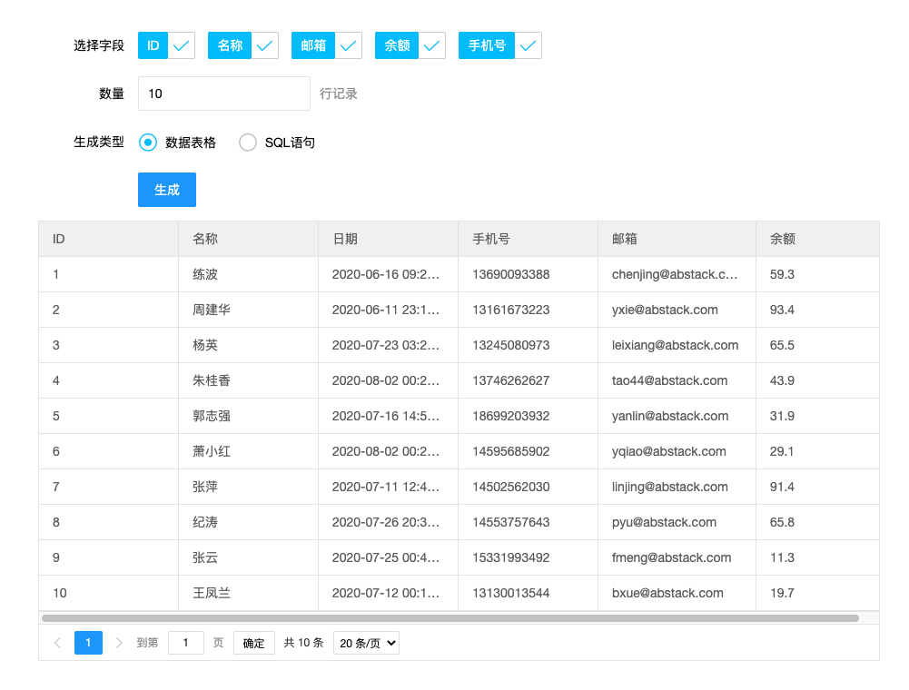

# fakedata
create fake data

## Quick Start

```bash
pip install -r requirements.txt

uvicorn main:app --reload
```


## TODO

- [ ] create insert sql
- [x] create data table
- [x] custom field data

## screenshot


